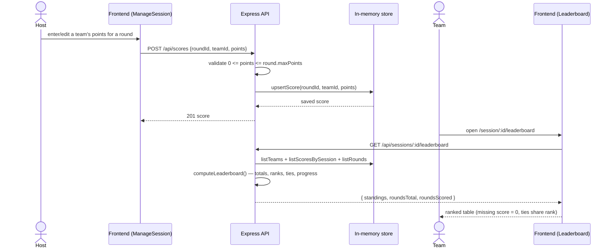
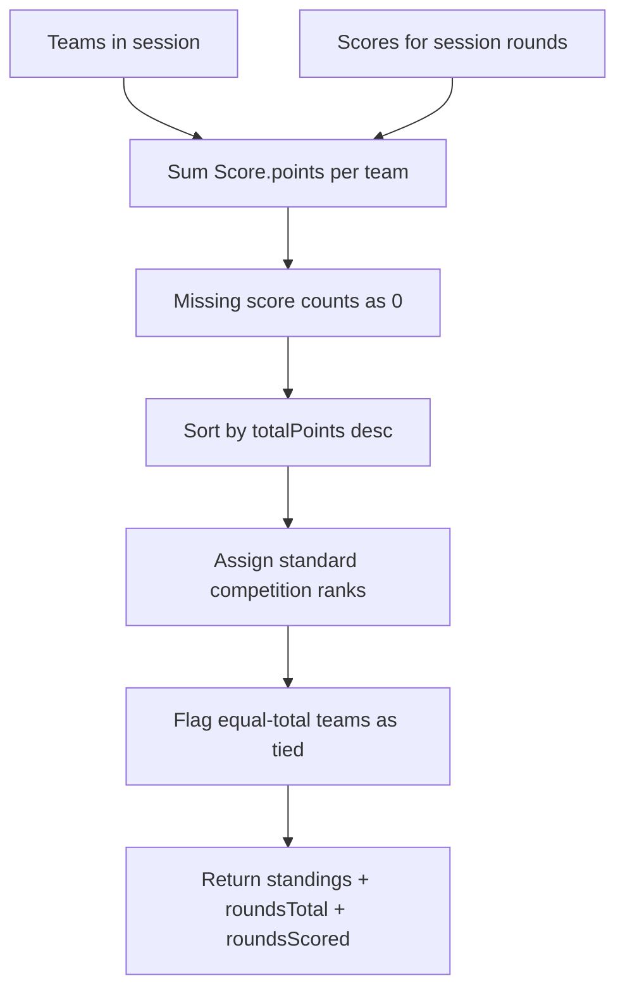

# Architecture — Trivia Night

Small monorepo: React (MUI) frontend ↔ Express backend with an in-memory store.
Below: the score-entry → leaderboard-update flow that Step 3 focuses on.

## Score entry → leaderboard update (sequence)

## Leaderboard computation

> Final tie-break (who wins an equal top score) is deliberately **not** modeled
> here — joint ranks only. The formal rule is added later via the SpecKit
> pipeline (Steps 5–6).
